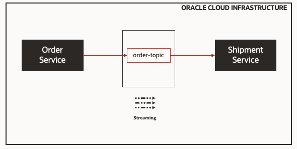

# oci-kafka-compatibility-oss

The [oci-kafka-compatibility-oss](https://github.com/lucassrg/oci-kafka-compatibility-oss) is a hands-on lab exercise that allow users to use Kafka APIs to produce and consume topics on Oracle Cloud Infrastructure Streaming Service (OSS).

Oracle Cloud Infrastructure Streaming Service is a managed service, scalable, and durable Kafka compatible messaging solution for ingesting continuous, high-volume streams of data that you can consume and process in real time.

It provides you all of the benefits of a Kafka cluster without having to deal with the setup and mainteance of the cluster.

## What are we building?

We will guide you on how to create Streams (Kafka topics) on Oracle Cloud Infrastructure (OCI) and then how you could create Microservices to Publish and Consume the messages using Kafka APIs. This content is based on a series of blog posts written by Todd Sharp @ [recursive.codes](https://recursive.codes/blog/post/1648). Here is the simplified solution architecture:


## Requirements

* OCI Tenancy with access to OSS
* Permission to manage IAM resources (Users, Groups and Policies)
* Access to OCI CloudShell
* Compartment (OCID) to create Stream
* Java GraalVM r11
* Gradle

## Build

First off we will need to create our Streams (topics) in OCI. The easiest way to do that is by using the OCI CLI using the [Cloud Shell](https://docs.oracle.com/en-us/iaas/Content/API/Concepts/cloudshellintro.htm).

### 1. Save Compartment OCID into a Environment Variable

We recommend using a dedicated IAM Compartment to store your Streams. If you don't have one yet, you can create it on:
> `Home > Identity > Compartments > Create Compartment`

Take notes on the Compartment OCID and open up Cloud Shell.

### 1. Create a Stream Pool

A stream pool is a grouping that you can use to organize and manage streams. Stream pools provide operational ease by providing an ability to share configuration settings across multiple streams. For customers using Streaming's Kafka compatibility feature, the stream pool serves as the root of a virtual Kafka cluster, thereby enabling every action on that virtual cluster to be scoped to that stream pool.

> Create the `e-commerce` stream pool:

```bash
oci streaming admin stream-pool create --name 'e-commerce' --compartment-id 'ocid1.compartment.oc1..aaaaaaaabgk'
```

Take notes on the `id` property returned by the command line:

```json
{
  "data": {
    "compartment-id": "ocid1.compartment.oc1..aaaaaaaabgk",
    "custom-encryption-key": {
      "key-state": "NONE",
      "kms-key-id": null
    },
    "defined-tags": {
      "Oracle-Tags": {
        "CreatedBy": "oracleidentitycloudservice/lucas.gomes@oracle.com",
        "CreatedOn": "2021-02-11T06:56:25.632Z"
      }
    },
    "endpoint-fqdn": null,
    "freeform-tags": {},
    "id": "ocid1.streampool.oc1.iad.amaaaaaadoga",
    "is-private": false,
    "kafka-settings": {
      "auto-create-topics-enable": false,
      "bootstrap-servers": null,
      "log-retention-hours": 24,
      "num-partitions": 1
    },
    "lifecycle-state": "CREATING",
    "lifecycle-state-details": null,
    "name": "e-commerce",
    "private-endpoint-settings": {
      "nsg-ids": null,
      "private-endpoint-ip": null,
      "subnet-id": null
    },
    "time-created": "2021-02-11T06:56:25.711000+00:00"
  },
  "etag": "\"91b256a3-d25d-4182-a8af-218ac4216220-36231994-6061-441c-b810-12312313\""
}
```

### 2. Create Streams

> Create `order-topic` stream

```bash
oci streaming admin stream create --name 'order-topic' --stream-pool-id 'ocid1.streampool.oc1.iad.amaaaaaadoga' --partitions 1
```

> Create `shipment-topic` stream

```bash
oci streaming admin stream create --name 'shipment-topic' --stream-pool-id 'ocid1.streampool.oc1.iad.amaaaaaadoga' --partitions 1
```

Take notes on the id.

### 3. Create IAM resources for your application

In this exercise we will create policies based on least privilege access. It is important to take notes on the resulting ids of all resources created through the next steps.

#### Create a "Service" user for your application

```bash
oci iam user create --name "streaming-app-user" --description "application user to use Streams"
```

#### Create a Group

```bash
oci iam group create --name "streaming-apps" --description "Group for Streaming Applications"
```

#### Associate the user with the Group

```bash
oci iam group add-user --user-id "ocid1.user.oc1..aaaaaaaaxld" --group-id "ocid1.group.oc1..aaaaaaaal5ed6lu"
```

#### Create a Policy to allow the application to use the Stream for publishing/subscribing

First you need to generate a json file using the command:

```bash
oci iam policy create --generate-full-command-json-input > create-stream-iam-policy.json
```

Update the `create-stream-iam-policy.json` file:

```json
{
  "compartmentId": "<compartment-ocid>",
  "description": "Policy to allow publishers/consumers to use a Stream",
  "name": "use-streams",
  "statements": [
    "Allow group streaming-apps to use stream-push in compartment id <compartment-ocid> where target.stream.id='<order-topic-stream-ocid>'",
    "Allow group streaming-apps to use stream-pull in compartment id <compartment-ocid> where target.stream.id='<order-topic-stream-ocid>'"
  ]
}
```

Run the command:

```bash
oci iam policy create --from-json file://create-stream-iam-policy.json
```

#### Generate Auth Token for your Streaming Application user

```bash
oci iam auth-token create --description "Stream App user auth token" --user-id  "ocid1.user.oc1..aaaaaaaaxld"
```

Take notes on the token as it is not displayed anymore, for example:

```json
{
  "data": {
    "description": "Stream App user auth token",
    "id": "ocid1.credential.oc1..aaaaaaaacmnlc4",
    "inactive-status": null,
    "lifecycle-state": "ACTIVE",
    "time-created": "2021-02-11T07:40:06.565000+00:00",
    "time-expires": null,
    "token": "d$.ab2rGa1C8J=sr8#bD",
    "user-id": "ocid1.user.oc1..aaaaaaaaxld"
  },
  "etag": "648e5e87e61ef6d7ae6706331bbe976d9f81b3f3"
}
```

### 4. Installing Pre-reqs

#### Installing SDKMAN on Mac/Unix

```bash
$ curl -s "https://get.sdkman.io" | bash

$ source "$HOME/.sdkman/bin/sdkman-init.sh"
```

Check installed version:

```bash

$ sdk version
SDKMAN 5.10.0+617
```

For other operating systems, check [SDKMAN documentation](https://sdkman.io/install).

#### Using Java GraalVM r11

First list Java versions available:

```bash

$ sdk list java
```

Identify Java GraalVM latest version, Release 11, for example:

```bash
GraalVM       |     | 21.0.0.r11   | grl     |            | 21.0.0.r11-grl
```

Install it:

```bash
$ sdk install java 21.0.0.r11-grl
```

Check installation:

```bash
$ java -version
openjdk version "11.0.10" 2021-01-19
OpenJDK Runtime Environment GraalVM CE 21.0.0 (build 11.0.10+8-jvmci-21.0-b06)
OpenJDK 64-Bit Server VM GraalVM CE 21.0.0 (build 11.0.10+8-jvmci-21.0-b06, mixed mode, sharing)
```

#### Installing Gradle

```bash
$ sdk install gradle
```

Check installation:

```bash
$ gradle -version                                          

Welcome to Gradle 6.8.2!

Here are the highlights of this release:
 - Faster Kotlin DSL script compilation
 - Vendor selection for Java toolchains
 - Convenient execution of tasks in composite builds
 - Consistent dependency resolution

For more details see https://docs.gradle.org/6.8.2/release-notes.html


------------------------------------------------------------
Gradle 6.8.2
------------------------------------------------------------

Build time:   2021-02-05 12:53:00 UTC
Revision:     b9bd4a5c6026ac52f690eaf2829ee26563cad426

Kotlin:       1.4.20
Groovy:       2.5.12
Ant:          Apache Ant(TM) version 1.10.9 compiled on September 27 2020
JVM:          11.0.10 (GraalVM Community 11.0.10+8-jvmci-21.0-b06)
OS:           Mac OS X 10.14.6 x86_64
```

### 5. Build Producer application

First you need to clone the repository containing the Producer application (Order Service). This is a service that is responsible for placing orders.

```bash
git clone https://github.com/lucassrg/order-svc-kafka.git
```

Open up the project using your favorite IDE.

#### Update OCI Streaming Service (OSS) configuration file

Next, we will copy the server configuration details from OSS in order to setup the application.

Go to the OCI console on `> Home > Analytics > Streaming > Stream Pools > e-commerce`

Under Resources section, click on Kafka Connection Settings and then `Copy All`.

Take notes on the these settings, for example:

```bash
bootstrap.servers=cell-1.streaming.us-ashburn-1.oci.oraclecloud.com:9092
security.protocol=SASL_SSL
sasl.mechanism=PLAIN
sasl.jaas.config=org.apache.kafka.common.security.plain.PlainLoginModule required username="odax/oracleidentitycloudservice/lucas.gomes@oracle.com/ocid1.streampool.oc1.iad.amaaaaaadoga" password="AUTH_TOKEN";
```

Note that we need to modify the username returned as part of the `sasl.jaas.config` string since we created an aplication specific user. The username is composed of the following values:
`username="<tenancy name>/<username>/<stream pool ocid>"`

Now update the application configuration file: `> src > main > resources > application-oss.yml`

```yaml
micronaut:
  application:
    name: orderSvc
  server:
    port: 8080
kafka:
  bootstrap:
    servers: streaming.us-phoenix-1.oci.oraclecloud.com:9092
  security:
    protocol: SASL_SSL
  sasl:
    mechanism: PLAIN
    jaas:
      config: ${KAFKA_SASL_JAAS_CONFIG}
```

Rather than using the variable `${KAFKA_SASL_JAAS_CONFIG}` in this example we will directly store the value in the property `sasl.jaas.config` with the username change. We should also replace the `"AUTH_TOKEN"` string with the IAM Auth token created on step 3.

At the end you should have something similar to this:

```yaml
micronaut:
  application:
    name: orderSvc
  server:
    port: 8080
kafka:
  bootstrap:
    servers: cell-1.streaming.us-ashburn-1.oci.oraclecloud.com:9092
  security:
    protocol: SASL_SSL
  sasl:
    mechanism: PLAIN
    jaas:
      config: org.apache.kafka.common.security.plain.PlainLoginModule required username="odax/streaming-app-user/ocid1.streampool.oc1.iad.amaaaaaadoga" password="d$.ab2rGa1C8J=sr8#bD";
```

> Running the Order service

```bash
$ ./gradlew run -Dmicronaut.environments=oss
```

> Testing the Order service


```bash
$ curl -s localhost:8080/order | jq
[]
```

> Adding new orders to the system

```bash
$ curl -s -H "Content-Type: application/json" -X POST -d '{"customerId": 1, "totalCost": 100.00}' localhost:8080/order | jq

$ curl -s -H "Content-Type: application/json" -X POST -d '{"customerId": 2, "totalCost": 200.00}' localhost:8080/order | jq
```

> Listing orders created by the service

```bash
curl -s localhost:8080/order | jq                                                                                        [
  {
    "id": 0,
    "customerId": 1,
    "totalCost": 100,
    "shipmentStatus": "PENDING"
  },
  {
    "id": 1,
    "customerId": 2,
    "totalCost": 200,
    "shipmentStatus": "PENDING"
  }
]
```

### 6. Build Consumer application

Next step we will build the consumer application. This is based on a shipping microservice that needs to consume all orders were placed to the topic to ship them to customers.

First you need to clone the repository containing the shipping service:

```bash
git clone https://github.com/lucassrg/shipping-svc-kafka.git

```

To simplify this exercise, the consumer application is based on the same architecture theh previous. Following the same idea, you need to update the application configuration file to point to the OSS Stream:
> src > main > resources > application-oss.yml

```yaml
micronaut:
  application:
    name: shippingSvc
  server:
    port: 8081
kafka:
  bootstrap:
    servers: cell-1.streaming.us-ashburn-1.oci.oraclecloud.com:9092
  security:
    protocol: SASL_SSL
  sasl:
    mechanism: PLAIN
    jaas:
      config: org.apache.kafka.common.security.plain.PlainLoginModule required username="odax/streaming-app-user/ocid1.streampool.oc1.iad.amaaaaaadoga" password="d$.ab2rGa1C8J=sr8#bD";

```

> Running the Shipping service

```bash
$ ./gradlew run -Dmicronaut.environments=oss
```

> Testing the Shipping service

```bash
$ curl -s localhost:8081/shipping/shipments/recent/5 | jq
[]
```

#### 7. Putting it together

Create new Orders

```bash
curl -s -H "Content-Type: application/json" -X POST -d '{"customerId": 4, "totalCost": 400.00}' localhost:8080/order | jq
{
  "id": 1,
  "customerId": 4,
  "totalCost": 400,
  "shipmentStatus": "PENDING"
}
```

Observe the shipping service console to see the log receiving new orders

```
18:19:08.938 [pool-1-thread-2] INFO  c.r.messaging.ShipmentProducer - Sending message with shipment 0 received!
18:19:08.938 [pool-1-thread-2] INFO  c.recursive.service.ShippingService - Shipment message sent!
18:19:08.938 [pool-1-thread-2] INFO  c.recursive.messaging.OrderConsumer - Shipped order 0 with shipment ID 0...
18:20:09.914 [pool-1-thread-3] INFO  c.recursive.messaging.OrderConsumer - Order with id 1 received!
18:20:09.914 [pool-1-thread-3] INFO  c.recursive.messaging.OrderConsumer - Creating shipment...
18:20:24.916 [pool-1-thread-3] INFO  c.recursive.service.ShippingService - Shipment created!
18:20:24.916 [pool-1-thread-3] INFO  c.recursive.service.ShippingService - Sending shipment message...
18:20:24.917 [pool-1-thread-3] INFO  c.r.messaging.ShipmentProducer - Sending message with key 36d08d00-85e5-41a8-b777-38be51039d6b received!
```

List the shipments were created.

```bash
curl -s localhost:8081/shipping/shipments/recent/5 | jq
[
  {
    "id": 0,
    "orderId": 0,
    "shippedOn": "2021-02-13T00:19:08.933Z"
  },
  {
    "id": 1,
    "orderId": 1,
    "shippedOn": "2021-02-13T00:20:24.916Z"
  }
]
```

## References:
* https://recursive.codes/p/easy-messaging-with-micronauts-kafka-support-and-oracle-streaming-service
* https://recursive.codes/p/message-driven-microservices-monoliths-with-micronaut-part-1:-installing-kafka-sending-your-first-message
* https://recursive.codes/blog/post/1650
* https://recursive.codes/blog/post/1648
* https://github.com/lucassrg/shipping-svc-kafka
* https://github.com/lucassrg/order-svc-kafka


## Troubleshooting

In case you have the following issue with gradle at the time you are compiling/building your project, you need to re-generate gradlew file using the command `gradle wrapper`.
```
Error: Could not find or load main class org.gradle.wrapper.GradleWrapperMain
Caused by: java.lang.ClassNotFoundException: org.gradle.wrapper.GradleWrapperMain
```