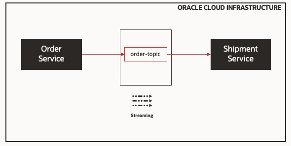
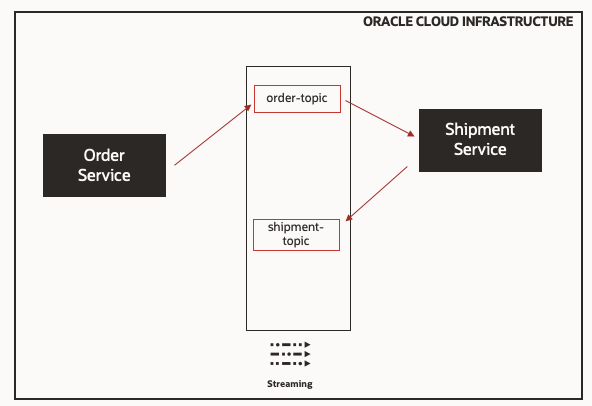

# Introduction

## Using Kafka APIs to produce and consume topics on Oracle Cloud Infrastructure Stream Service (OSS) 

This is a hands-on lab exercise that allow users to use Kafka APIs to produce and consume topics on Oracle Cloud Infrastructure Streaming Service (OSS).

Estimated time: 90 minutes

## Oracle Cloud Infrastructure Streaming Service (OSS)

Oracle Cloud Infrastructure Streaming Service is a managed service, scalable, and durable Kafka compatible messaging solution for ingesting continuous, high-volume streams of data that you can consume and process in real time.

It provides you all of the benefits of a Kafka cluster without having to deal with the setup and maintenance of the cluster.

### Objectives

In this lab, you will:
* Create Streams (Kafka topics) on Oracle Cloud Infrastructure Streaming Service
* Create Microservices to Publish and Consume the messages using Kafka APIs

## Prerequisites

* OCI Tenancy with access to OSS
* Permission to manage IAM resources (Users, Groups and Policies)
* Access to OCI CloudShell
* Compartment (OCID) to create Stream
* Java GraalVM r11
* Gradle

You may now [proceed to the next lab](#next).

## Learn More

* [OCI Streaming Service](https://www.oracle.com/cloud-native/streaming/)
* [Message Driven Microservices & Monoliths with Micronaut - Part 3: Switching to Oracle Streaming Service](https://recursive.codes/blog/post/1648)

## Acknowledgements

* **Author** - Lucas Gomes
* **Contributors** -  Rishi Johari
* **Last Updated By/Date** - Lucas Gomes, August 2021